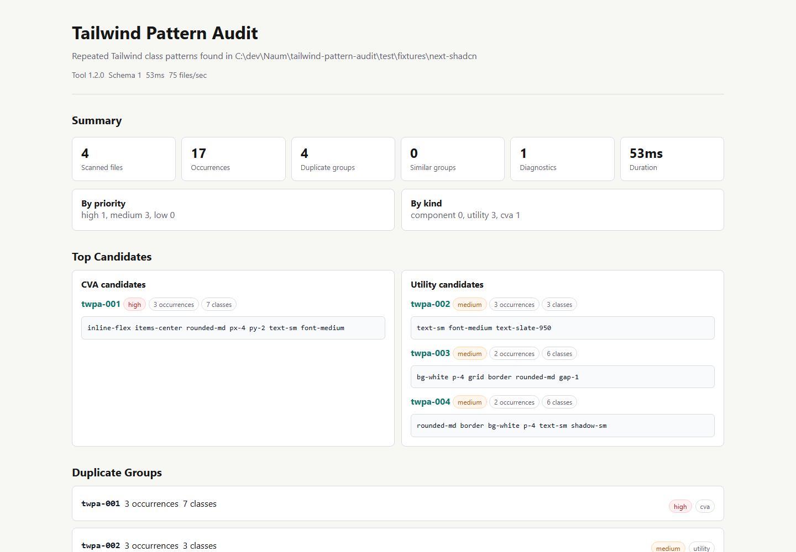

# HTML Report

`tailwind-pattern-audit` can write a self-contained HTML report for local review, sharing with a
team, or attaching to CI artifacts.

```bash
tailwind-pattern-audit --html --output tailwind-audit.html
```

The report includes summary metrics, top extraction candidates, duplicate groups, similar groups
when enabled, and diagnostics.



## Similar Patterns

Near-duplicate detection is opt-in. Enable it when you want the HTML report to include similar
class sets, not just exact repeated strings:

```bash
tailwind-pattern-audit --html --similar --min-similarity 0.7 --output tailwind-audit.html
```

## CI Artifacts

The HTML report is static, so it can be uploaded as a workflow artifact:

```yaml
- run: npx --yes tailwind-pattern-audit@latest --html --output tailwind-audit.html
- uses: actions/upload-artifact@v4
  with:
    name: tailwind-pattern-audit-html
    path: tailwind-audit.html
```

Use SARIF instead when you want GitHub code scanning annotations.
